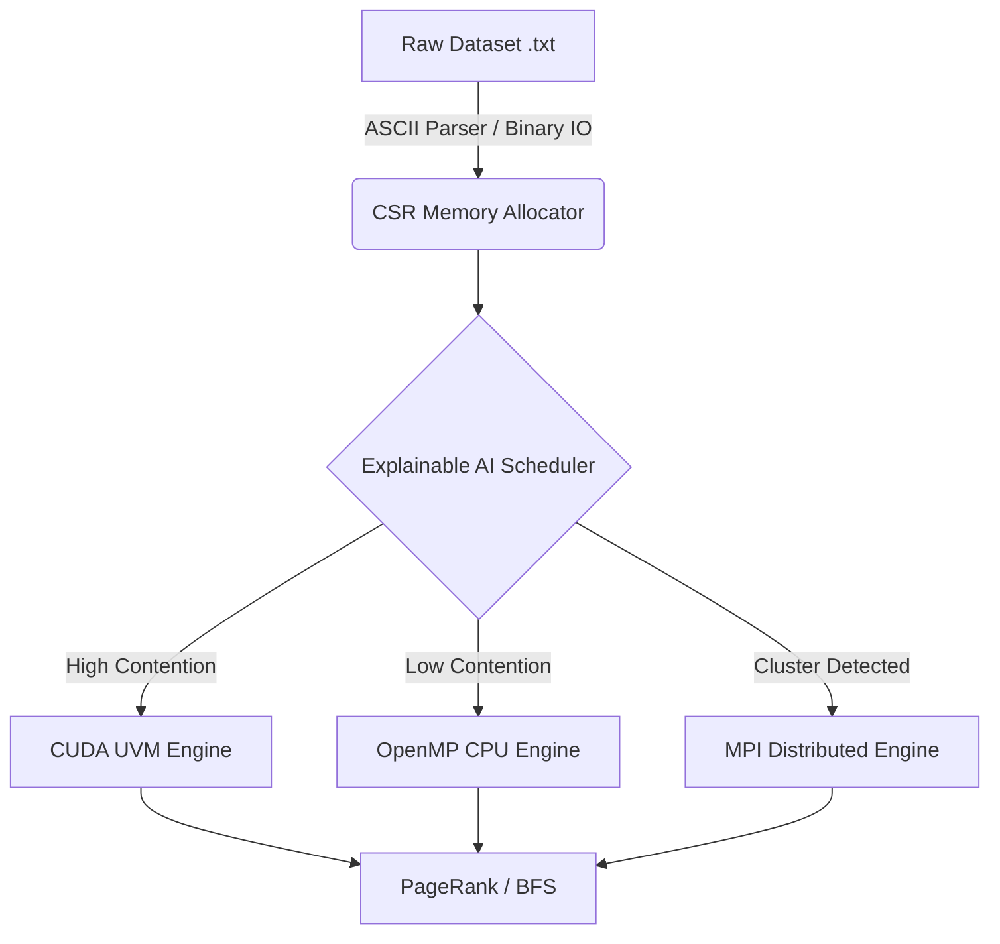

# Adaptive Graph Engine 🚀


A High-Performance, Distributed, and Hardware-Accelerated Graph Processing Engine built from scratch in C++. 

This engine is designed to execute massive-scale graph algorithms (PageRank, BFS) by dynamically routing workloads across CPUs (OpenMP), GPUs (CUDA), or Supercomputing Clusters (MPI) based on the topological characteristics of the input dataset.

---

## ⚡ Core Features

### 1. The Explainable AI Scheduler
The engine features a heuristic-based `AdaptiveScheduler` that analyzes graph topology at runtime (Vertex/Edge ratio, Power-Law vs. Uniform distributions, VRAM constraints) to mathematically determine the optimal hardware execution path.
- **Dense/Uniform Graphs:** Routed to the CPU with lock-free OpenMP threading.
- **Power-Law/Sparse Graphs:** Routed to the GPU utilizing NVIDIA CUDA.
- **Massive Datasets:** Routed to the Distributed MPI Cluster mode.

### 2. GPU Acceleration (CUDA)
- **Unified Virtual Memory (UVM):** Supports graphs larger than available VRAM via zero-copy PCI-E page faulting.
- **Explicit Memory Transfers:** Includes a hardcore `cudaMemcpy` backend for scientifically benchmarking UVM latency vs. explicit PCI-E bandwidth.
- **Warp-Divergence Mitigation:** Optimized kernel architectures to maximize GPU SM utilization on irregular graph topologies.

### 3. CPU Multi-Threading (OpenMP)
- Implements **Lock-Free** synchronization using C++ Atomics (`std::atomic<float>`).
- Demonstrates near-linear strong scaling in accordance with Amdahl’s Law.

### 4. Supercomputer Cluster Execution (MPI)
- Scales out across multiple nodes using the **Message Passing Interface (MPI)**.
- Implements 1D Vertex Partitioning and `MPI_Allreduce` for rapid distributed network synchronization.

### 5. Instantaneous Binary I/O
- Eliminates ASCII parsing bottlenecks by compiling raw CSR memory layouts directly to SSD caches (`.bin`).
- Achieves sub-200ms loading times for massive datasets by blasting bytes straight to RAM via `std::fread`.

### 6. Observability Dashboard
- A highly technical React/FastAPI dashboard to visualize real-time benchmarking telemetry, Strong Scaling analysis, and UVM memory transfer architectures.

---

## 🛠️ Architecture



---

## 🚀 Getting Started

### Prerequisites
- **OS:** Linux (or Windows WSL2)
- **Compiler:** GCC 9+ (C++17 Support)
- **GPU:** NVIDIA GPU with CUDA Toolkit 11.0+ installed
- **Distributed:** OpenMPI installed (`sudo apt install openmpi-bin libopenmpi-dev`)
- **Build System:** CMake 3.24+

### Compilation
```bash
mkdir build && cd build
cmake ..
make -j
```

### Execution Modes

**1. Standard / Adaptive Mode**
```bash
./src/graph_engine ../data/amazon0302.txt
```

**2. Statistical Benchmark Mode (Averages across 4 runs)**
```bash
./src/graph_engine ../data/amazon0302.txt --benchmark --runs 4
```

**3. Amdahl's Law Scaling Analysis**
```bash
./src/graph_engine ../data/amazon0302.txt --scaling
```

**4. MPI Supercomputer Cluster Mode (Simulate 4 nodes)**
```bash
mpirun -np 4 ./src/graph_engine ../data/amazon0302.txt
```

---

## 📊 Dashboard UI

To launch the telemetry dashboard:
```bash
# Terminal 1: Launch FastAPI Backend
cd backend && uvicorn main:app --reload

# Terminal 2: Launch React UI
cd frontend && npm run dev
```
Navigate to `http://localhost:5173`.

---

## 📜 License
Distributed under the MIT License. See `LICENSE` for more information.
