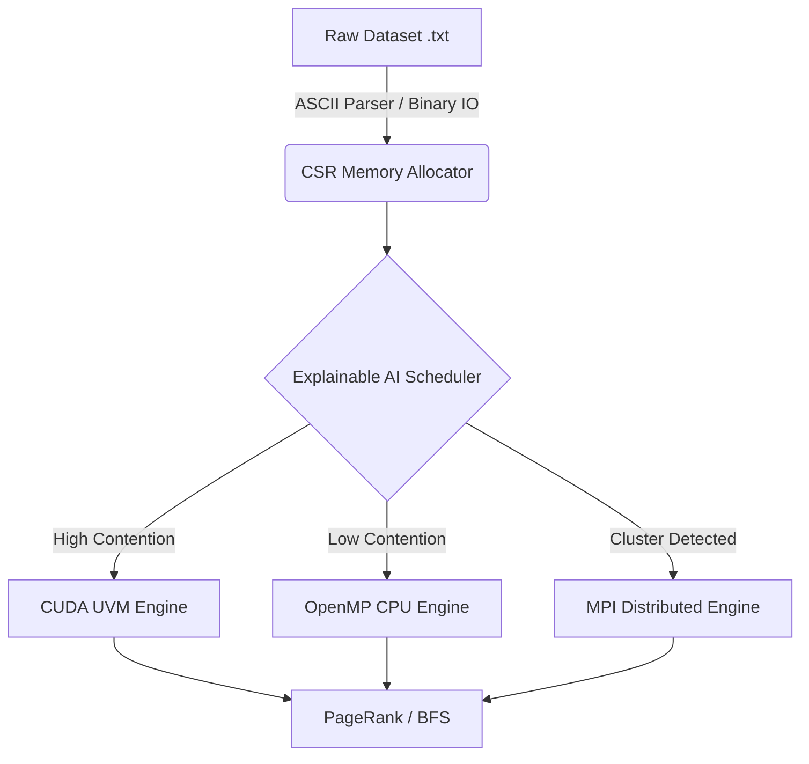

# Adaptive Graph Engine


A High-Performance, Distributed, and Hardware-Accelerated Graph Processing Engine developed in C++. 

This system is engineered for the execution of massive-scale graph algorithms (e.g., PageRank, Breadth-First Search) across heterogeneous compute environments. It dynamically routes workloads to CPU Thread Pools (OpenMP), Graphics Processing Units (CUDA), or Distributed Supercomputing Clusters (MPI) based on runtime topological analysis of the dataset.

---

## Architecture and Core Capabilities

### 1. The Explainable AI Scheduler
The engine features a heuristic-based `AdaptiveScheduler` that analyzes graph topology at runtime. It evaluates metrics such as the Vertex-to-Edge ratio, Power-Law vs. Uniform degree distributions, and available VRAM. Based on these parameters, it mathematically determines the optimal hardware execution path:
- **Dense/Uniform Graphs:** Routed to the CPU, utilizing lock-free OpenMP threading to handle high contention.
- **Power-Law/Sparse Graphs:** Routed to the GPU via NVIDIA CUDA to maximize memory bandwidth and SM utilization.
- **Massive Datasets:** Routed to the Distributed MPI Cluster mode for partitioned execution.

### 2. GPU Acceleration (CUDA)
- **Unified Virtual Memory (UVM):** Employs zero-copy PCI-E page faulting to support graphs whose memory footprints exceed available VRAM capacity.
- **Explicit Memory Transfers:** Integrates a secondary `cudaMemcpy` backend to scientifically benchmark UVM latency overhead against explicit PCI-E bus bandwidth.
- **Warp-Divergence Mitigation:** Features optimized kernel architectures to maintain high GPU Streaming Multiprocessor (SM) occupancy when traversing highly irregular graph topologies.

### 3. CPU Multi-Threading (OpenMP)
- Implements **Lock-Free** synchronization using C++ standard library atomics (`std::atomic<float>`) to eliminate mutex bottlenecks during concurrent state updates.
- Demonstrates near-linear strong scaling characteristics in accordance with Amdahl's Law.

### 4. Distributed Cluster Execution (MPI)
- Scales out across multiple physical nodes utilizing the **Message Passing Interface (MPI)**.
- Implements a 1D Vertex Partitioning strategy coupled with `MPI_Allreduce` primitives to achieve rapid, global network synchronization across the distributed cluster.

### 5. High-Throughput Binary Serialization
- Eliminates standard ASCII parsing bottlenecks by compiling raw Compressed Sparse Row (CSR) memory layouts directly to SSD storage caches (`.bin`).
- Achieves sub-200ms loading latencies for 68-million edge datasets by reading contiguous byte blocks directly into RAM via `std::fread`.

### 6. Observability and Telemetry Dashboard
- A highly technical React and FastAPI-based dashboard designed to visualize real-time benchmarking telemetry, Strong Scaling analysis curves, and hardware execution traces.

---

## Technical Architecture Flow



---

## Build and Execution Guidelines

### Prerequisites
- **OS:** Linux (Ubuntu/CentOS) or Windows WSL2
- **Compiler:** GCC 9.0+ (C++17 Support Required)
- **GPU:** NVIDIA GPU with CUDA Toolkit 11.0+
- **Distributed Environment:** OpenMPI installed (`sudo apt install openmpi-bin libopenmpi-dev`)
- **Build System:** CMake 3.24+

### Compilation
```bash
mkdir build && cd build
cmake ..
make -j
```

### Execution Modes

**1. Adaptive Mode (Algorithmic Routing)**
```bash
./src/graph_engine ../data/amazon0302.txt
```

**2. Statistical Benchmark Mode (Averages across 4 runs)**
```bash
./src/graph_engine ../data/amazon0302.txt --benchmark --runs 4
```

**3. Amdahl's Law Scaling Analysis**
```bash
./src/graph_engine ../data/amazon0302.txt --scaling
```

**4. MPI Cluster Mode (Simulate 4 nodes)**
```bash
mpirun -np 4 ./src/graph_engine ../data/amazon0302.txt
```

---

## Telemetry Dashboard UI

To initialize the hardware observability dashboard:
```bash
# Terminal 1: Launch FastAPI Backend
cd backend && uvicorn main:app --reload

# Terminal 2: Launch React UI
cd frontend && npm run dev
```
Navigate to `http://localhost:5173`.

---

## Contributors

- **M. Hemanth Reddy** - *Lead Software Engineer / HPC Developer*

---

## License
Distributed under the MIT License. See `LICENSE` for more information.
